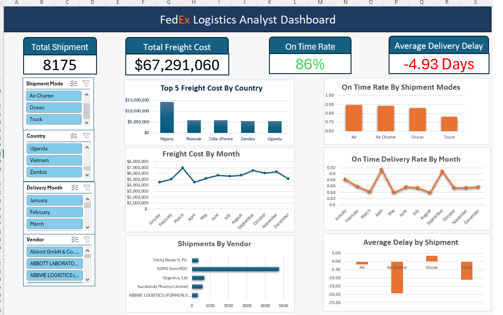

# 📦 Logistics Performance Analysis

# FedEx Logistics Analyst Dashboard

## 📌 Project Overview
This project analyzes logistics performance using data analytics and visualization techniques, with a focus on identifying key factors that impact delivery efficiency, cost, and service quality.

The project combines **data preprocessing, exploratory analysis, and Excel dashboard visualization** to provide actionable insights for logistics optimization.

---

## 🎯 Business Problem
In logistics operations, delays, inefficient routes, and poor resource allocation can significantly affect customer satisfaction and operational costs.

This project aims to answer:
- What factors cause delivery delays?
- How do shipping modes impact performance?
- Which regions or categories are underperforming?
- How can logistics efficiency be improved?

---

## 📊 Dataset Description
The dataset includes logistics-related information such as:
- Details (ID, Weight (Kilograms), Freight Cost (USD) ,region )
- Shipping mode (Air, Truck , Air Charter, Ocean)
- Delivery time (Scheduled Delivery Date / Delivered to Client Date /Delivery Recorded Date)
  

---

## 🧹 Data Processing
- Handled missing and inconsistent values
- Converted categorical variables
- Feature engineering (e.g., delivery duration, delay flag)
- Data cleaning for dashboard integration

---

## 📈 Exploratory Data Analysis (EDA)
Key analyses performed:
- Delivery time distribution
- Delay rate by shipping mode
- Performance by region 

## 📊 Dashboard (Excel)
An interactive Excel dashboard was developed to visualize key logistics metrics:

### Features:
- KPI overview (Total Orders, Delay Rate, Avg Delivery Time , Total cost)
- Filters by region, vendor, and shipping mode
- Trend analysis over time
- Comparative performance across segments

## 🧠 Key Insights
- **Shipping mode is the most critical factor affecting delivery time**
- **Operational inefficiencies exist in specific regions**
- Data-driven dashboards can support real-time decision-making

---

## 🛠️ Tools & Technologies
- Excel (Dashboard, Pivot Tables, Visualization)
- Python (optional: Pandas, matplotlib, sklearn )
- Data Cleaning & Transformation

---

## 📂 Open the Excel dashboard
dashboard excel/Logistics_Dashboard.xlsx
